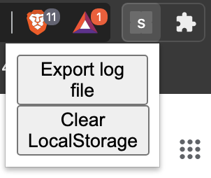

# savitri

## Install

1. Clone this repository.
2. Go to Extentions section of Chrome.
3. Turn on Developer mode.
4. Press `Load unpacked`.
5. Select `savitri` folder.

## How to use.

First, make sure of enabling the `#native-file-system-api` flag in `chrome://flags`.(FYI: [chrome://flags/#native-file-system-api](chrome://flags/#native-file-system-api))  

 This use localstorage to store URL lists temporary.  

Press `Export log file` to save all URLs listed.
Press `Clear LocalStorage` to delete all URLs listed.
