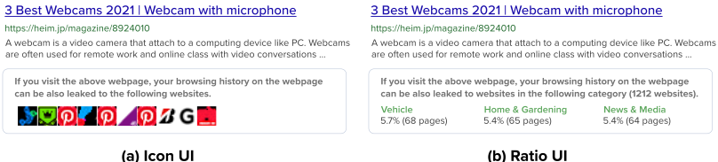

# savitr
This is experiment system for our research paper. The purpose is to collect behavior logs while information retrieval using proposed interface.

## Background

Personalized information delivery on the web has become increasingly popular; however, with the increase in personalized information delivery, data privacy issues have become an important social issue. 
Currently, many people use such blockers to prevent their browsing histories from being leaked; however, technologies have been developed to avoid tracking blockers.
It is difficult for purely technology-oriented approaches to provide complete protection against online tracking risks.
To protect data privacy on the web, users must also adopt effective behaviors to protect their privacy in web search and browsing.

Some people understand that their web browsing histories can be collected during web search and browsing; however, web searchers have few opportunities to understand who collects their browsing history, as well as how and when this information is collected. 
As a result, many web searchers do not know how to protect their data privacy when performing web searches. 

## My proposal
We proposes the search user interfaces (UI) to provide web search users with comprehensive information about to whom web browsing histories could be leaked and how much. 
To this end, we propose the following search result representations on SERPs and reveal how the representation user interfaces (UI) influence privacy awareness and user search behavior.

### Icon UI
The Icon UI presents favicons to display specific examples of websites to which the browsing history on a web search result could be leaked when users click (i.e., browse) the result.
### Ratio UI
The Ratio UI presents a summary of the categories and number of websites to which the browsing history on a web search result could be leaked.

---

We expect that the proposed Icon and Ratio UIs will enable web searchers to understand such privacy risks and search with balances between the risks and benefits of web browsing before visiting webpages.
