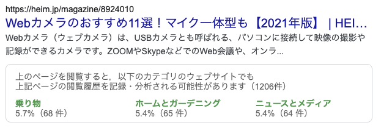

# savitr

This is experiment system for my graduate thesis.
The purpose is to collect behavior logs of user in information retrieval with proposal interface.

## Background

For better advertiseing, various ad provider use tracking system like third party cookie.
This kinds of tracking system is efficient for better ad, but users' privacy is sacrificed.
However, most user does not aware that thier behavior data is collected by these tracking system.
So, most users do not have enough chance to think about thier privacy protection.

## My proposal

Before user visits a webpage, show web page titles they had been visited in the past that have possibility to be collected.

- Icon UI

- Distribution UI

