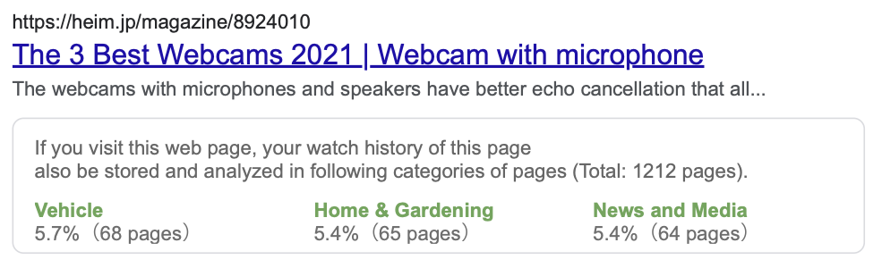
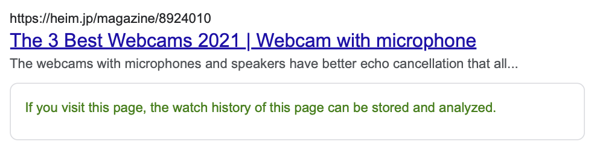

# Search system

We developed a web-based search system to conduct the search tasks and monitor participant behaviors during the user study.
The system generates privacy risk indicators for each web search result on SERPs as follows.

1. Web search results are fetched using the API of a conventional web search engine (e.g., Google or Bing).
2. Each search result (webpage) on the SERPs is assessed to determine whether it contains third-party cookies.
3. If a target search result contains third-party cookies, the system checks whether the issuing domains of the cookies (i.e., third-party domains) appear in a list of third-party domains detected for popular websites.% in advance.
4. If search result X shares the same third-party domains with popular website Y, the system determines that the browsing histories on X can be shared to Y (i.e., website Y is a sharing destination).
5. Privacy-aware snippets with privacy risk indicators are generated using a list of sharing destinations.

Here, we used the Bing Web Search API[^1] to prepare the titles, URLs, and snippets displayed in the search results.
We issued the queries `web camera recommend,` `earphone recommend,` `diabetes symptom,` and `Meniere symptom` into the API and obtained 100 search results for each query prior to conducting the user study.
Each result on the SERPs comprised three components that are common to web search, i.e., the title, URL, and content description (i.e., snippet), as well as the privacy risk indicator.
% The system presented SERPs for a fixed query in each search task.
A SERP presented a list of 10 webpages (i.e., search results) matching the given query.
The system paginated 10 SERPs for each query.
Thus, each participant viewed at most 100 webpages for the given query.
Although our SERPs imitated the SERPs of common web search engines, we configured the search system such that the participants could not modify the search queries on SERPs for each search task.
We needed to fix search results and generate privacy risk indicators for the results prior to conducting the user study so that the system could present web search results with low latency.
Consequently, the system displayed a fixed list of 100 webpages for a fixed query in each task.
There corresponding webpage was displayed when the participants clicked each search result.

Then, we analyzed the third-party cookies of the collected web search results to examine the presence of trackers.
For step 3, we prepared a list of famous/popular websites using SimilarWeb.com[^2], which is a web service that analyzes website traffic exhaustively.
Using SimilarWeb.com, we created a list of the top 100 most frequently accessed Japanese websites for 24 main categories.
Here, we refer to the listed 2400 websites as _famous websites_.

In steps 2 and 3, the prototype system analyzes third-party cookies in webpages using the open source **webXray** tool[^3] , which analyzes webpage traffic and content to identify companies that collect user data.
Unfortunately, the **webXray** tool spends a long time scanning a webpage to detect third-party cookies.
The tool is too slow to scan a list of web search results for real-time during web searches.
Therefore, we analyzed the webpages prepared for our user study (i.e., the web search results for search tasks and the _famous websites_) using **webXray** before conducting the user study.

<!-- Note that we confirmed all collected web search results contained embedded with trackers. -->

The prototype search system uses information about the obtained sharing destinations to generate privacy-aware snippets in the **Icon**, **Ratio**, and **Control** UIs.
For the **Icon** UI, the prototype system displays a limited number of sharing destination websites with their favicons for each web search result that contains embedded trackers.
The system calculates the inverse document frequency (IDF) of sharing destinations to limit the number of displayed sharing destinations.
Here, let  <!-- $N$ --> be the number of web search results in a search result list for a given query and let  be the number of search results from which browsing histories can be shared to the destination .
Then, the IDF of  <!-- $d = idf(d)$ --> is defined as follows:

<!-- $idf(d) = log\frac{N}{df(d)}$. -->

The **Icon** UI presented favicons to display specific examples of sharing destination websites to which the browsing history on a web search result could be shared.
For each web search result, the **Icon** UI displays the top five IDF sharing destination websites as popular sharing destinations and the bottom five IDF sharing destinations as unique destinations for the search result.

  

The **Ratio** UI presented a summary of the popular categories of potential sharing destinations.
In addition, the **Ratio** UI presented the number of sharing destinations and their ratios of total in three categories.
The **Ratio** UI counts the number of sharing destinations for each search result according to the topic categories of SimilarWeb.com.
Then, the **Ratio** UI displays the top three categories of sharing destinations with their numbers and ratios of total for each web search result.

  

For the **Control** UI, if a web search result has sharing destinations, the system simply displays a tracker indicator with the result.

  

For all search UIs, we controlled whether the privacy risk indicators would be displayed on the web search results depending on search result ranks.

  

As shown in figure above, the search system displayed the risk indicators only for web search results in odd-ranked positions.
This manipulation was implemented to display web search results with and without the risk indicators as equally as possible.
One purpose of this study was to examine how privacy risk indicators affect participant behaviors in web searches.
We expected that this manipulation would enable us to compare the click counts of web search results with and without risk indicators.

[^1]: [https://docs.microsoft.com/en-us/azure/cognitive-services/bing-web-search/overview](https://docs.microsoft.com/en-us/azure/cognitive-services/bing-web-search/overview)
[^2]: [https://www.similarweb.com](https://www.similarweb.com)
[^3]: Timothy Libert. 2015. Exposing the Hidden Web: An Analysis of Third-Party HTTP Requests on 1 Million Websites. International Journal of Communication (2015), 1–10.
